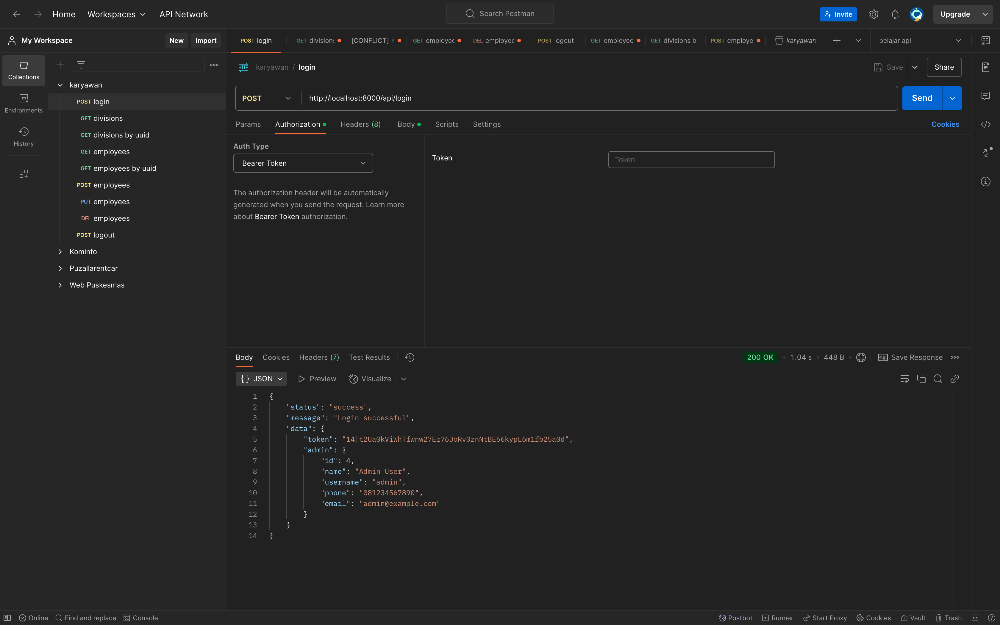
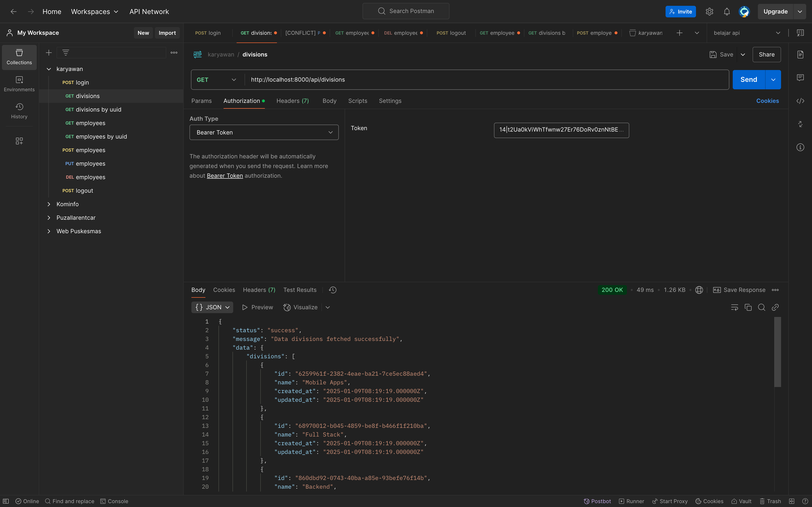
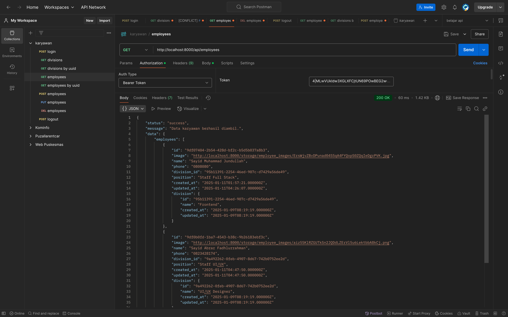
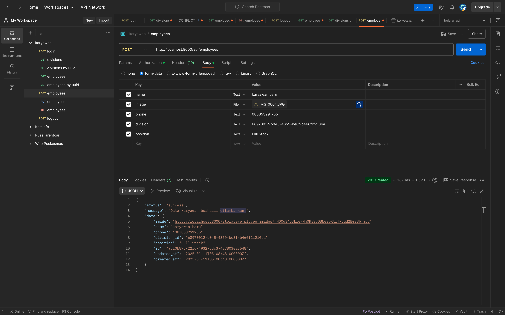
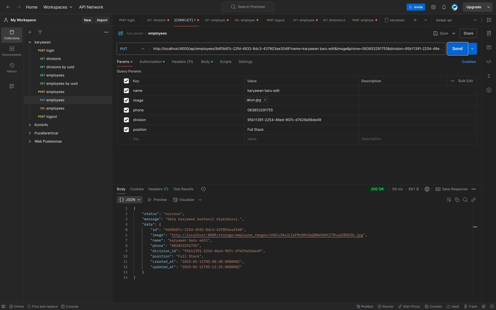
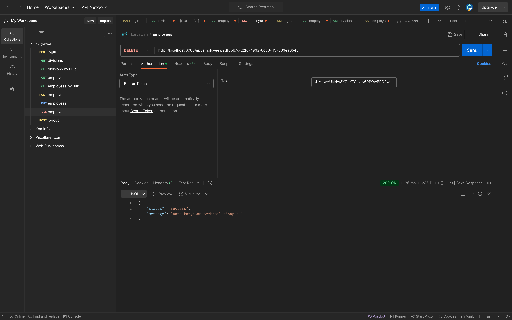
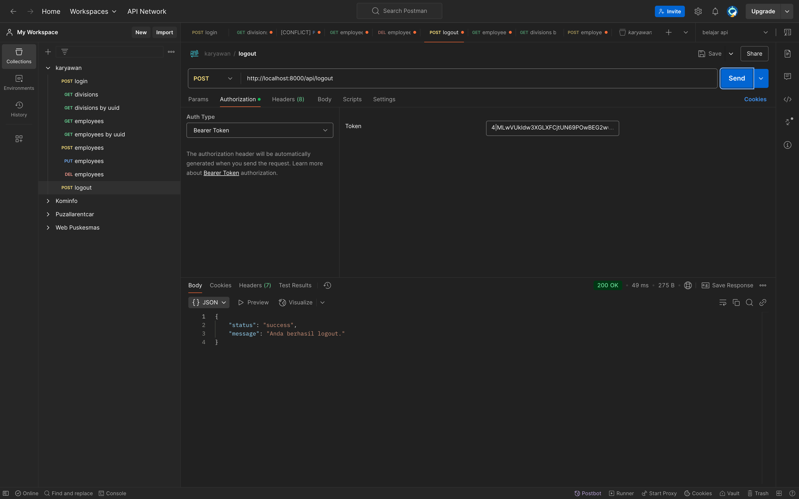

# Screenshots

## Tugas 1 - Membuat Api Login

## Tugas 2 - Membuat Api Get All Data Divisi

## Tugas 3 - Membuat Api Get All Data Karyawan

## Tugas 4 - Membuat Api Create Data Karyawan

## Tugas 5 - Membuat Api Update Data Karyawan

## Tugas 6 - Membuat Api Delete Data Karyawan

## Tugas 7 - Membuat Api Logout

